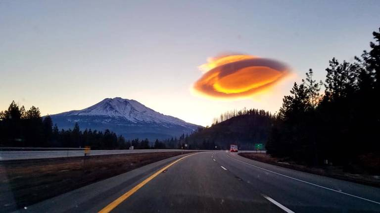
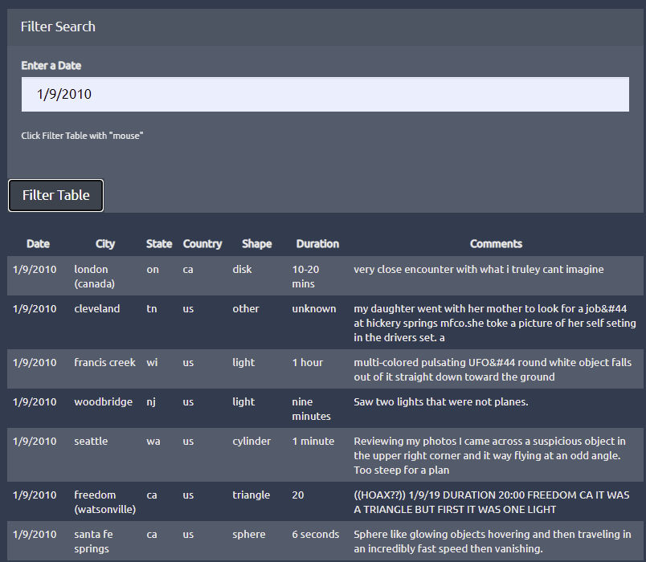
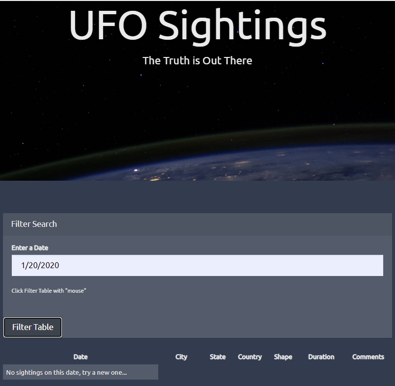
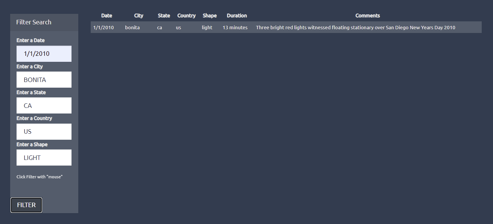
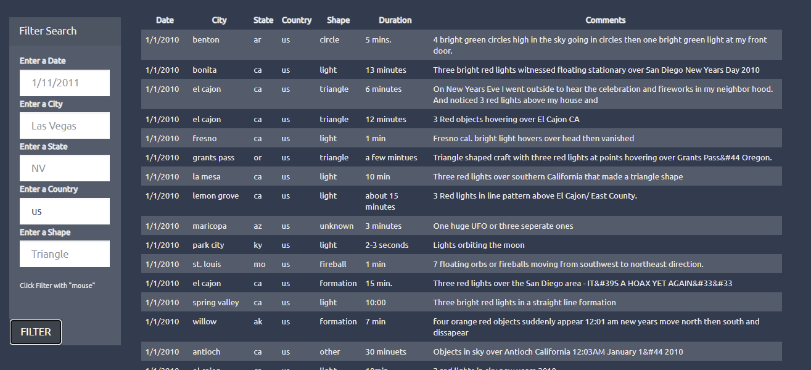

# JavaScript-Challenge
**********************************
### By Karla M. Murphy
*********************************

* Deploy github page: [UFO Sightings](https://krla20.github.io/javascript-challenge/)

* The extra-terrestrial menace has come to Earth and we here at `ALIENS-R-REAL` have collected all of the eye-witness reports we could to prove it! All we need to do now is put this information online for the world to see and then the matter will finally be put to rest.

* There is just one tiny problem though... our collection is too large to search through manually. Even our most dedicated followers are complaining that they are having trouble locating specific reports in this mess.

* That's why we need you to write code that will create a table dynamically based upon a [dataset we provide](Instructions/StarterCode/static/js/data.js). We also need to allow our users to filter the table data for specific values. There's a catch though... we only use pure JavaScript, HTML, and CSS, and D3.js on our web pages. They are the only coding languages which can be trusted.

        Guess what???!!! ...You can handle this... right? The planet Earth needs to know what we have found!

### Level 1: Automatic Table and Date Search (Required)

* Make sure you have a column for `date/time`, `city`, `state`, `country`, `shape`, and `comment` at the very least.

* Use a date form in your HTML document and write JavaScript code that will listen for events and search through the `date/time` column to find rows that match user input.

        - If it's not a lucky day => No sightings on this date, try a new one...

### Level 2: Multiple Search Categories (Optional)

* Using multiple `input` tags and/or select dropdowns, write JavaScript code so the user can to set multiple filters and search for UFO sightings using the following criteria based on the table columns:

  1. `date/time`
  2. `city`
  3. `state`
  4. `country`
  5. `shape`

* You can filter all values at onces: 

        
* You can file only by 1 value:

